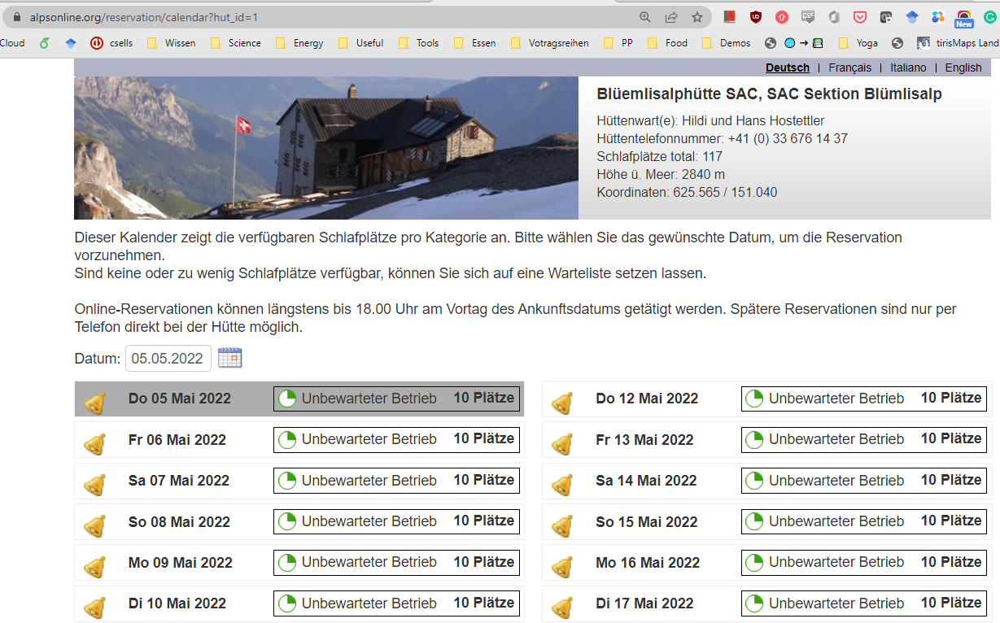
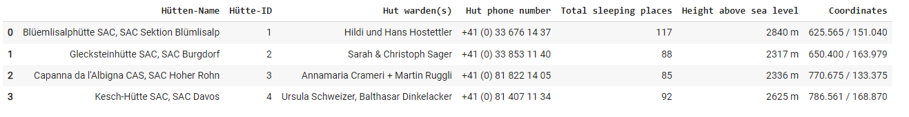
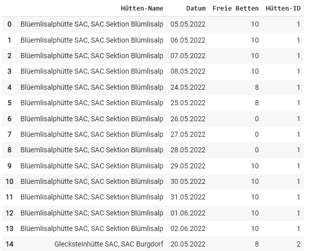

# DAV Hut Crawler

The idea of this script is to scrape the data from the [online reservation portal](https://www.alpenverein.de/huetten-wege-touren/huetteninfo/huetten-in-den-alpen/onlinereservierungssystem-der-alpenvereinshuetten_aid_28962.html). This allows to check availability for any date in the current season. 

This makes it easy to identify a free hut on any giving data, instead of browsing them manually.



List of Huts:


List of free beds:


## Installation

Requires Python >=3.8

### Selenium

Runnig it locally You need to install a WebDriver:
- https://www.selenium.dev/documentation/webdriver/getting_started/install_drivers/
- https://stackoverflow.com/questions/64717302/deprecationwarning-executable-path-has-been-deprecated-selenium-python
- If working with anaconda: ```conda install -c conda-forge webdrivermanager```


For Google Colab use:

```
### Solution that works in google Colab
#!pip install kora -q
#from kora.selenium import wd
```


## Usage

Run ```run.py```

- Select start-date (the next 14 days are evaluated)
- Select all huts or a list of huts ```[1,2,30]``` the IDs can be found in ...
- Currently implemented as variables in  ```run.py```

- For booking, the huts can be found with their ID at ```https://www.alpsonline.org/reservation/calendar?hut_id=1```


## Roadmap

### Must

- Interaktive Ergebnistabelle
- Sinnvolles Auswählen von Hütten
- Sinnvolles Filtern nach Datum


### Can

- Dasboard mit Karte Datum ein Freiheit
- Fallunterscheidung bei Kooridnaten: Schweizer Hütten sind im eigenen Kooridnatensystem
- Timeouts optimieren, damit Abruf schnell und vollständig

### Further Ideas

- Putting everything in a google colab, so everyone can run it from everywhere